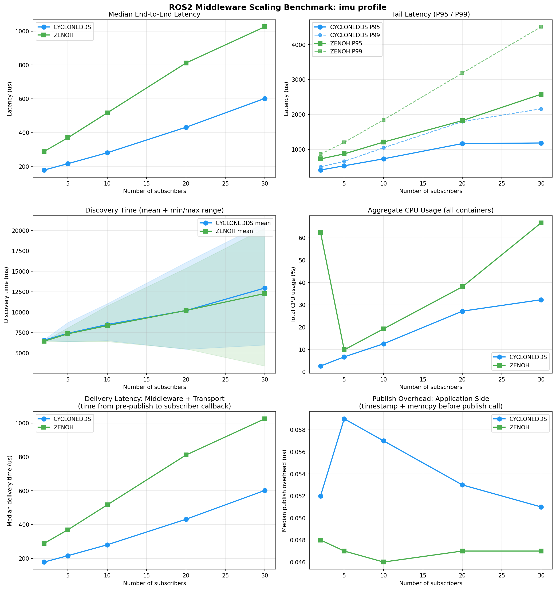

# Out-of-the-Box ROS2 Middleware Benchmark

### CycloneDDS vs Zenoh: How Does Your Middleware Scale?

A systematic benchmark measuring how CycloneDDS (rmw_cyclonedds_cpp) and Zenoh (rmw_zenoh_cpp v0.1.8) perform as the number of ROS2 nodes scales from 2 to 30, using message profiles tied to real robotics workloads.

This benchmark focuses on **developer experience performance** rather than theoretical throughput and
 measures **out-of-the-box performance** of ROS2 middleware implementations
under a standard single-host deployment scenario.

It is designed to answer the practical question:

> "What performance should I expect if I install ROS2 and run my system without tuning?"

The results reflect:
- default configurations
- typical developer workflows
- no middleware-specific optimizations

They do NOT represent:
- maximum achievable performance after tuning
- WAN / wireless / multi-host scenarios
- optimal Zenoh deployment architectures (router-based, cloud-connected, etc.)



---

## Baseline Results

### Latency: Lower latency observed with CycloneDDS (default config)

| Subscribers | CycloneDDS median | Zenoh median | Zenoh overhead |
|-------------|------------------|-------------|----------------|
| 2 | 178 us | 289 us | +62% |
| 5 | 216 us | 369 us | +71% |
| 10 | 280 us | 516 us | +84% |
| 20 | 432 us | 812 us | +88% |
| 30 | 602 us | 1026 us | +70% |

Both scale linearly with node count. CycloneDDS adds ~15 us per subscriber, Zenoh adds ~26 us.

### Latency breakdown: it's all in the delivery path

Publish overhead (application-side timestamp + memcpy) is ~0.1 us for both middleware and constant across all node counts. The entire latency difference is in the **delivery path** (middleware serialization + transport + deserialization + callback scheduling).

### Discovery time: comparable

Both middleware show similar discovery times on a Docker bridge network (6.5s at 2 nodes, 13s at 30 nodes). Zenoh's documented discovery advantages apply to WAN/Wi-Fi scenarios, not single-host Docker.

### CPU usage: Zenoh consumes 2x more

At 30 subscribers, CycloneDDS uses 32% total CPU vs Zenoh's 67%. This gap is consistent across all node counts.

### Large messages: CycloneDDS handles 200KB payloads

CycloneDDS delivers 200KB PointCloud2 messages at 3.5ms median (10 subscribers). Zenoh peer-to-peer mode did not reliably deliver messages of this size in our Docker bridge setup.

---

## What This Means (and What It Doesn't)

These results reflect **RMW implementation maturity**, not protocol capability. CycloneDDS (rmw_cyclonedds_cpp) is a mature, optimized implementation. Zenoh (rmw_zenoh_cpp v0.1.8) is younger and still being optimized for the ROS2 use case.

This benchmark intentionally does not cover scenarios where Zenoh is expected to outperform DDS, such as WAN communication, unreliable networks, or large-scale distributed systems.
 For those use cases, see [Zhang et al. 2023](https://arxiv.org/abs/2309.07496) and [ZettaScale's benchmarks](https://zenoh.io/blog/2021-03-23-discovery/).

**For engineers choosing a middleware today:** if your system runs on a single host or LAN with up to 30 nodes at default settings, CycloneDDS delivers lower latency and uses fewer resources. If you need WAN communication, fleet-scale discovery, or are planning for multi-site deployment, Zenoh's architecture may offer advantages that this benchmark was not designed to capture.

---

## Practical Takeaways

- **If you run ROS2 on a single machine or LAN with default settings:**
  CycloneDDS provides lower latency and better CPU efficiency.

- **If you need WAN communication, NAT traversal, or fleet-scale systems:**
  Zenoh offers architectural advantages not covered in this benchmark.

- **If you plan to tune your middleware:**
  These results are a baseline, not a limit. Both systems can behave differently under optimized configurations.
  
---

## Experiment Design

### Configuration

| Parameter | Value |
|-----------|-------|
| ROS2 distro | Humble |
| CycloneDDS | rmw_cyclonedds_cpp (default config) |
| Zenoh | rmw_zenoh_cpp v0.1.8 (peer-to-peer, multicast scouting) |
| Topology | Fan-out: 1 publisher, N subscribers |
| Message rate | 100 Hz (IMU), 10 Hz (PointCloud2) |
| Messages per run | 5000 (+ 500 warmup) |
| Mock processing | 100 us fixed sleep per message |
| QoS | RELIABLE, KeepLast(10) |
| Infrastructure | Docker containers on bridge network |
| Hardware | Ubuntu Linux, 4 cores, 16 GB RAM |

### Measured Metrics

| Metric | Method |
|--------|--------|
| **End-to-end latency** | `steady_clock` timestamp embedded by publisher, delta on receive |
| **Publish overhead** | Time between timestamp capture and pre-publish (t2 - t1) |
| **Delivery latency** | Time from pre-publish to subscriber callback (t3 - t2) |
| **Discovery time** | Interval from subscriber start to first message received |
| **CPU / Memory** | Per-container via `docker stats` |

### Message Profiles

| Profile | Size | Real-World Equivalent | Frequency |
|---------|------|-----------------------|-----------|
| `imu` | 300 B | `sensor_msgs/Imu` | 100 Hz |
| `pointcloud` | 200 KB | `sensor_msgs/PointCloud2` | 10 Hz |

### Timestamp Mechanism

Each message carries a 24-byte header:

| Offset | Size | Field |
|--------|------|-------|
| 0 | 8 B | t1: timestamp before payload preparation |
| 8 | 8 B | t2: timestamp just before `publish()` call |
| 16 | 4 B | sequence number |
| 20 | 4 B | publisher node ID |

Subscriber records t3 (receive time) immediately on callback entry, before mock processing.

---

## Full Results

### CycloneDDS Scaling (IMU, 300 bytes, 100 Hz)

| Nodes | Median (us) | P95 (us) | P99 (us) | Discovery (ms) | CPU (%) | RAM (MiB) |
|-------|-------------|----------|----------|-----------------|---------|-----------|
| 2 | 178 | 409 | - | 6583 | 2.6 | 39 |
| 5 | 216 | 530 | - | 7410 | 6.7 | 97 |
| 10 | 280 | 730 | - | 8492 | 12.5 | 199 |
| 20 | 432 | 1167 | - | 10200 | 27.2 | 415 |
| 30 | 602 | 1184 | - | 12956 | 32.3 | 650 |

### Zenoh Scaling (IMU, 300 bytes, 100 Hz)

| Nodes | Median (us) | P95 (us) | P99 (us) | Discovery (ms) | CPU (%) | RAM (MiB) |
|-------|-------------|----------|----------|-----------------|---------|-----------|
| 2 | 289 | 727 | - | 6450 | 62.4 | 501 |
| 5 | 369 | 871 | - | 7352 | 9.8 | 104 |
| 10 | 516 | 1209 | - | 8355 | 19.2 | 220 |
| 20 | 812 | 1824 | - | 10211 | 38.1 | 480 |
| 30 | 1026 | 2579 | - | 12284 | 66.7 | 789 |

### CycloneDDS PointCloud2 (200 KB, 10 Hz, 10 subscribers)

| Median (us) | P95 (us) | Discovery (ms) | CPU (%) |
|-------------|----------|-----------------|---------|
| 3542 | 11241 | 5609 | 8.5 |

---

## Known Limitations

| # | Limitation | Impact | Mitigation |
|---|-----------|--------|------------|
| 1 | **Single host** | No real network effects | Measures middleware overhead, not network. Complements network-focused studies. |
| 2 | **Resource contention** | 30 containers on 4 cores | CPU load documented. Degradation threshold will be higher on multi-machine setups. |
| 3 | **Docker bridge** | Adds transport overhead | Same overhead for both middleware. Baseline measured via clock_check. |
| 4 | **Default configs** | DDS is tuning-dependent | Intentional: represents typical developer experience. Tuned comparison planned. |
| 5 | **rmw_zenoh_cpp maturity** | v0.1.8 is early | Results may improve significantly in future versions. |
| 6 | **Zenoh large messages** | PointCloud2 not delivered in peer-to-peer mode | Needs further investigation. May require router mode or transport tuning. |

---

## Reproducing Results

### Prerequisites

- Docker and Docker Compose
- Python 3.8+ with matplotlib (`pip3 install matplotlib`)

### Build and Run

```bash
# Build
docker compose build benchmark

# Quick suite: IMU profile, both middleware, 2-30 nodes
python3 scripts/run_all.py --quick

# Full suite
python3 scripts/run_all.py

# Analyze and generate plots
python3 scripts/analyze.py
```

### Single Experiment

```bash
python3 scripts/run_experiment.py \
  --rmw rmw_cyclonedds_cpp \
  --profile imu \
  --subscribers 10 \
  --messages 5000
```

---

## Project Structure

```
ros2_middleware_benchmark/
|-- docker/
|   |-- Dockerfile
|   |-- entrypoint.sh
|   |-- zenoh_peer_config.json5
|   +-- zenoh_router_config.json5
|-- src/
|   |-- CMakeLists.txt
|   |-- package.xml
|   |-- include/benchmark_node/config.hpp
|   +-- src/
|       |-- publisher_node.cpp
|       |-- subscriber_node.cpp
|       +-- clock_check.cpp
|-- scripts/
|   |-- run_experiment.py
|   |-- run_all.py
|   +-- analyze.py
|-- results/
|   |-- summary.csv
|   +-- plots/
|-- docker-compose.yml
+-- README.md
```

---

## Planned Work

- [ ] Tuned DDS configuration (Publication 2)
- [ ] Zenoh UDP transport vs TCP
- [ ] Fan-in topology (N publishers, 1 subscriber)
- [ ] Multi-host experiments
- [ ] `ros2_tracing` integration for kernel-level breakdown

---

## Related Work

- Zhang, J. et al. (2023). [Comparison of Middlewares in Edge-to-Edge and Edge-to-Cloud Communication for Distributed ROS2 Systems.](https://arxiv.org/abs/2309.07496)
- ZettaScale (2021). [Minimizing Discovery Overhead in ROS2.](https://zenoh.io/blog/2021-03-23-discovery/)
- Springer (2024). [Performance Comparison of ROS2 Middlewares for Multi-robot Mesh Networks in Planetary Exploration.](https://link.springer.com/article/10.1007/s10846-024-02211-2)

---

## License

MIT

## Author

**Evgeniia Slepynina** -- Senior C++ / Robotics Engineer

- [LinkedIn](https://www.linkedin.com/in/evgeniia-slepynina-a3802a249)
- slepynina.eu@gmail.com
